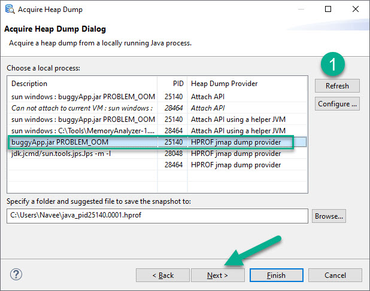

# How to acquire heap dump in Eclipse MAT?

- Launch `Eclipse MAT`
- Go to `File > Acquire Heap Dump`
- Click on `Refresh` to select the app

- Click on `Next` and then `Finish`

Heap dump will be saved in the folder you mention (see the above screenshot)

