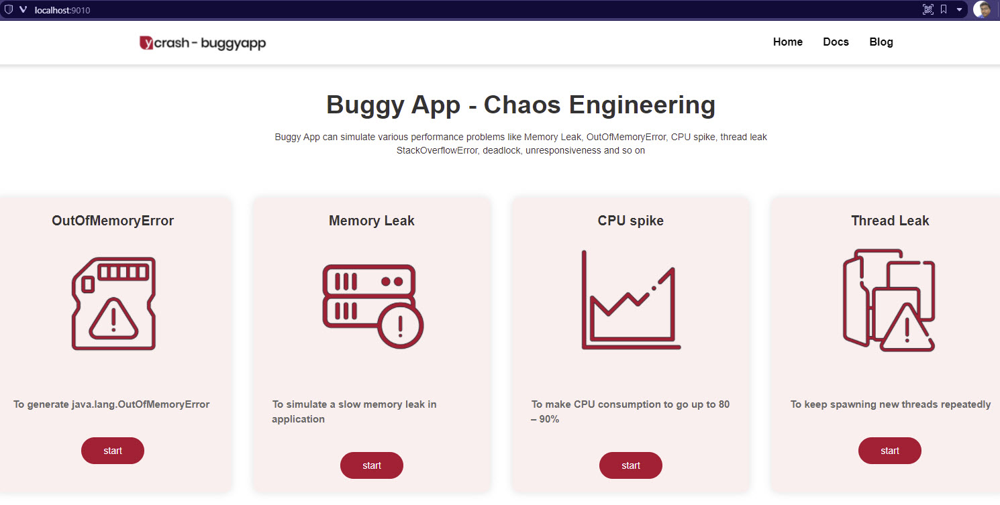

# 🐛 About BuggyApp

BuggyApp helps to simulate various performance problems to learn the concept of performance engineering and debugging.

# 🏃‍♀️ How to get started with BuggyApp?

BuggyApp has two flavors: Java app and Web app.

## Getting Started with the Java app

### Prerequisites

- Java 8 or above

### Running the app

- Download the latest release from `https://github.com/ycrash/buggyapp/releases/`
- Unzip the archive
- `cd` into `buggyapp` folder
- Run `java -Xmx512m -jar buggyApp.jar PROBLEM_OOM` which will simulate Out of Memory problem

### Running the Web app

- Clone the repo `https://github.com/ycrash/buggyapp.git`
- `cd` into `buggyapp\embedded-runner`
- Run `launch.bat` for Windows or `sh launch.sh` for Unix systems
- Launch `http://localhost:9010`

- By default, it will run in `9010` port. To change it, open `launch.sh` or `launch.bat` to change the port number.