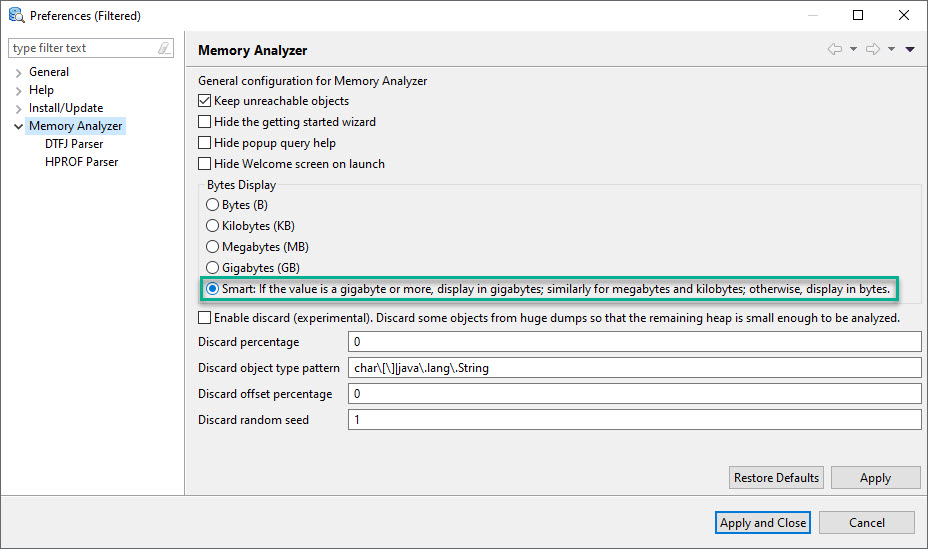

# About Eclipse MAT

The Eclipse Memory Analyzer is a fast and feature-rich Java heap analyzer that helps you find memory leaks and reduce memory consumption.

# Download 

- https://www.eclipse.org/mat/

# Settings

- Launch `Eclipse MAT`
- Go to `Windows > Preferences` 
- Click on `Memory Analyzer`
- Select `Smart` option as shown below.

- Click on `Apply and Close`